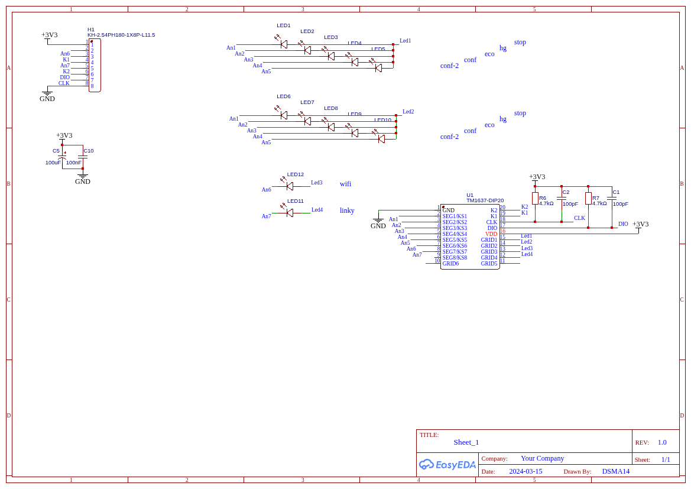
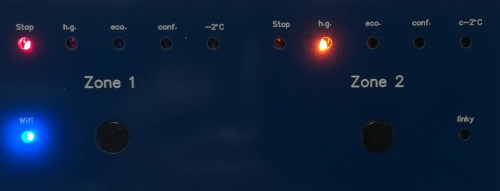

# Heating 2Z — Kit d'affichage TM1637 + Bargraphe LEDs

Kit PCB d'affichage pour le [gestionnaire de chauffage 2 zones ESP32-C6](https://github.com/Papymakers/esp32-heating-2z).  
Composé de **3 cartes PCB complémentaires** montées dans un boîtier DIN 6 modules.

> Disponible sur [papymakers.com](https://papymakers.com) — **15 € le kit (3 PCB)**

---

## Contenu du kit

Le kit comprend trois PCB qui s'empilent et se connectent entre eux :

### PCB 1 — Face avant
Façade percée aux dimensions du boîtier DIN, avec les ouvertures pour :
- les digits TM1637 (afficheur 7 segments)
- les LEDs bargraphe de statut des 2 zones
- les boutons tactiles SW1 / SW2

### PCB 2 — Afficheur TM1637 + LEDs
Carte de fond portant :
- l'afficheur **TM1637-DIP20** (4 digits 7 segments)
- 2 rangées de **5 LEDs bargraphe** (Zone 1 : hg / eco / conf / conf-2 / stop, Zone 2 : idem)
- 2 LEDs indicatrices : **wifi** (An6) et **linky** (An7)
- le circuit de découplage alimentation (C5 100µF, C10 100nF, R1 100kΩ)
- les résistances de pull-up CLK/DIO (R6, R7 — 4.7kΩ) et condensateurs de filtrage (C1, C2 — 100pF)

### PCB 3 — Liaison + Switches
Carte intermédiaire assurant :
- la connexion vers la **carte principale ESP32-C6** via le connecteur ZIF H1 pas 2.54mm, 8 points (TE Connectivity réf. constructeur 487925-1)
- le support des **2 switches** SW1 et SW2 -changement de mode - (OMRON réf. constructeur B3F-3150) 
- Key Cap 6mm black (OMRON ref. constructeur B32-2010)
---

## Schéma électrique

**Brochage connecteur H1 (8 pins, 2.54mm)** :

| Pin | Signal | Rôle |
|-----|--------|------|
| 1   | +3V3   | Alimentation |
| 2   | An1    | LED bargraphe (anode commune Zone 1 + Zone 2) |
| 3   | An2    | LED bargraphe |
| 4   | An3    | LED bargraphe |
| 5   | An4    | LED bargraphe |
| 6   | K1     | Cathode Zone 1 bargraphe |
| 7   | K2     | Cathode Zone 2 bargraphe |
| 8   | An5    | LED bargraphe (conf-2 / stop) |
| -   | An6    | LED wifi |
| -   | An7    | LED linky |
| -   | DIO    | TM1637 data |
| -   | CLK    | TM1637 horloge |
| -   | GND    | Masse |

---

## Aperçu FACE AVANT

*PCB Heating Control 08/25 — vue EasyEDA*

---

## Compatibilité

Ce kit d'affichage est conçu pour fonctionner avec le firmware **esp32-heating-2z v4.0-2Z** ou supérieur,
compilé avec la directive `#define DISPLAY_TM1637`.

| Firmware | Compatible |
|----------|-----------|
| esp32-heating-2z (TM1637 bargraphe) | ✅ |
| esp32-heating-2z (TM1637 7 segments) | ✅ |
| esp32-heating-2z (OLED SSD1306) | ❌ (PCB différents) |

---

## Montage

1. Fixer le **PCB 3 (liaison + switches)** sur la carte principale via le connecteur H1
2. Empiler le **PCB 2 (TM1637 + LEDs)** sur le PCB 3
3. Clipser la **façade (PCB 1)** en face avant du boîtier DIN

Le boîtier cible est un **DIN 6 modules** (105 mm).

---

## Acheter

Le kit 3 PCB est disponible sur **[papymakers.com](https://papymakers.com)** — **15 € le lot**.

La **carte principale ESP32-C6** (gestionnaire de chauffage 2 zones) est vendue séparément.

---

## Licence

Ce dépôt contient la documentation matérielle (schémas, aperçus PCB, descriptions).  
Les fichiers sources EasyEDA et Gerbers ne sont pas distribués.

**MIT License** — © 2025 [Papy Makers](https://papymakers.com)
