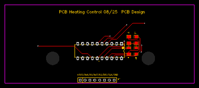

# Hardware — Kit affichage 2 zones

## Architecture 3 PCB

```
┌─────────────────────────────────┐
│  PCB 1 — Face avant             │  Façade DIN, ouvertures digits + LEDs + boutons
└────────────┬────────────────────┘
             │ (empilage / clips)
┌────────────▼────────────────────┐
│  PCB 2 — TM1637 + LEDs         │  TM1637-DIP20, 10 LEDs bargraphe, 2 LEDs état
└────────────┬────────────────────┘
             │ connecteur interne
┌────────────▼────────────────────┐
│  PCB 3 — Liaison + Switches     │  H1 (8 pins 2.54mm) → carte principale
│                                 │  SW1 (sélection zone) + SW2 (changement mode)
└─────────────────────────────────┘
             │ connecteur H1 KH-2.54PH180-1X8P
┌────────────▼────────────────────┐
│  Carte principale ESP32-C6      │  (vendue séparément)
└─────────────────────────────────┘
```

## Schéma électrique


### Zones bargraphe LEDs

| Rangée | LEDs | Labels | Signal anode |
|--------|------|--------|--------------|
| Zone 1 | LED1–LED5 | hg / eco / conf / conf-2 / stop | An1–An5 (+ Led1) |
| Zone 2 | LED6–LED10 | hg / eco / conf / conf-2 / stop | An1–An5 (+ Led2) |

Les cathodes de zone sont multiplexées : **K1** pour Zone 1, **K2** pour Zone 2.

### LEDs indicatrices

| LED | Signal | Indication |
|-----|--------|-----------|
| LED12 | An6 | Connexion WiFi |
| LED11 | An7 | Activité Linky TIC |

### TM1637 (U1 — DIP20)

- Pull-up **CLK** : R6 4.7kΩ vers +3V3, condensateur C2 100pF vers GND
- Pull-up **DIO** : R7 4.7kΩ vers +3V3, condensateur C1 100pF vers GND
- Alimenté en +3V3

### Découplage alimentation

| Composant | Valeur | Rôle |
|-----------|--------|------|
| C5        | 100µF  | Bulk, stabilisation +3V3 |
| C10       | 100nF  | Découplage HF |
| R1        | 100kΩ  | Pull-down / réinitialisation |

## Aperçu PCB



*Révision 08/25 — dessin EasyEDA, fabrication JLCPCB*

## Boîtier

DIN rail **6 modules** (105 mm).
